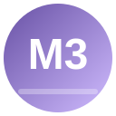

# 🎨 md3gen — Material Design 3 组件快速生成器

<p align="center">
  
</p>

<p align="center">
  <strong>依据 Material Design 3 最新规范，一键生成跨框架 UI 组件、页面模板与主题配置。</strong>
</p>

<p align="center">
  
  
  
  
</p>

---

## 📖 目录

- [核心特性](#-核心特性)
- [快速开始](#-快速开始)
- [支持的技术栈](#-支持的技术栈)
- [组件清单](#-组件清单)
- [页面模板](#-页面模板)
- [主题系统](#-主题系统)
- [命令参考](#-命令参考)
- [MD3 设计令牌](#-md3-设计令牌)
- [文件结构](#-文件结构)
- [安装与使用](#-安装与使用)

---

## ✨ 核心特性

### 🎯 六大技术栈全覆盖

| 框架 | UI 库方案 | 样式方案 |
|------|----------|---------|
| **React** | MUI v5+ / 纯组件 | CSS Modules / CSS Custom Properties |
| **Vue 3** | Vuetify 3 / 纯组件 | Scoped CSS / CSS Custom Properties |
| **Angular** | Angular Material v15+ | MD3 Theming API |
| **Flutter** | Material 3 Widgets | ThemeData(useMaterial3: true) |
| **Lit** | Web Components | Shadow DOM + CSS Variables |
| **纯 HTML/CSS** | — | CSS Custom Properties |

### 🎨 完整 MD3 设计系统

```
┌─────────────────────────────────────────────────────────┐
│                    MD3 Design System                     │
├──────────┬──────────┬──────────┬──────────┬────────────┤
│  HCT色彩  │ 字体阶梯  │ 圆角系统  │ 海拔系统  │  状态层    │
│ 25个颜色槽 │ 15级阶梯  │  7级圆角  │ 6级海拔   │ 4种交互态  │
├──────────┼──────────┼──────────┼──────────┼────────────┤
│ 动态取色  │ 暗色模式  │  无障碍   │  RTL    │  响应式     │
│ wallpaper │ auto     │  ARIA    │  logical │ Compact     │
│   based   │ prefers  │ keyboard │  props   │ Medium      │
│           │ scheme   │ support  │  support │ Expanded    │
└──────────┴──────────┴──────────┴──────────┴────────────┘
```

### 🔧 三大核心能力

| 能力 | 说明 | 覆盖范围 |
|------|------|---------|
| **组件生成** | 一键生成符合 MD3 规范的组件代码 | 40+ 种组件 |
| **模板生成** | 常用页面模板，开箱即用 | 15 个模板 |
| **主题系统** | 色彩方案生成、暗色模式、多格式导出 | 5 种导出格式 |

---

## 🚀 快速开始

### 生成组件

```bash
# 生成一个 MD3 Filled Button (React + CSS)
/md3 button filled react

# 生成 Card (Vue 3 + Vuetify)
/md3 card elevated vue3

# 生成 Dialog (纯 HTML/CSS)
/md3 dialog basic html

# 生成 FAB
/md3 fab primary react

# 生成 Chip
/md3 chip filter react
```

### 生成页面模板

```bash
# 登录页
/md3 template login

# 仪表盘
/md3 template dashboard

# 设置页
/md3 template settings

# 列表页（带搜索 + FAB）
/md3 template list --with-search --with-fab

# 引导页（3步）
/md3 template onboarding --steps=3
```

### 生成主题

```bash
# 从种子色生成完整色彩方案
/md3 theme generate --seed=#6750A4

# 生成暗色主题
/md3 theme dark

# 导出 CSS 变量
/md3 theme export --format=css

# 导出 Tailwind CSS preset
/md3 theme export --format=tailwind

# 导出 Flutter ThemeData
/md3 theme export --format=flutter
```

### 自然语言生成页面

```bash
/md3 page "一个音乐播放器界面，底部有播放控制栏"
/md3 page "电商商品详情页，顶部大图，价格，购买按钮"
```

---

## 🛠 支持的技术栈

### React + MUI v5+

```tsx
// 使用 createTheme 注入 MD3 tokens
import { createTheme, ThemeProvider } from '@mui/material';

const md3Theme = createTheme({
  palette: {
    primary: { main: '#6750A4', contrastText: '#FFFFFF' },
    secondary: { main: '#625B71' },
    // ... 完整 M3 palette
  },
  shape: { borderRadius: 20 },
});

// 直接使用 MUI 组件，自动获得 MD3 风格
<Button variant="filled">MD3 Button</Button>
```

### React + 纯 CSS

```tsx
import { MD3Button } from './components/MD3Button';

// 所有样式使用 var(--md-sys-color-*) 变量
<MD3Button variant="filled" icon={<AddIcon />}>
  创建项目
</MD3Button>
```

### Vue 3 + Vuetify 3

```vue
<template>
  <v-btn variant="tonal" rounded="pill">
    MD3 Tonal Button
  </v-btn>
</template>
```

### 纯 HTML/CSS

```html
<!-- 引入 MD3 主题 CSS -->
<link rel="stylesheet" href="md3-theme-base.css">

<!-- 使用 MD3 组件 -->
<button class="md3-button md3-button--filled">
  <span class="md3-button__state-layer"></span>
  <span class="md3-button__label">Button</span>
</button>
```

---

## 📦 组件清单

### Actions 动作组件

| 组件 | 变体 | 说明 |
|------|------|------|
| **Button** | filled / outlined / text / elevated / tonal | 5 种按钮变体，40dp 高，pill 形状 |
| **FAB** | primary / surface / secondary / tertiary / small / large | 6 种悬浮按钮，支持 96dp 大尺寸 |
| **IconButton** | standard / filled / tonal / outlined | 4 种图标按钮，支持 toggle |
| **SegmentedButton** | — | 分段按钮组 |

### Communication 通信组件

| 组件 | 说明 |
|------|------|
| **Badge** | 徽标，dot 或数字模式 |
| **Progress** | linear / circular 进度指示器 |
| **Snackbar** | 底部消息条，支持 action |

### Containment 容器组件

| 组件 | 变体 | 说明 |
|------|------|------|
| **Card** | elevated / filled / outlined | 3 种卡片 |
| **Dialog** | basic / fullscreen | 对话框，28px 圆角 |
| **BottomSheet** | — | 底部面板 |
| **Divider** | — | 分割线 |

### Navigation 导航组件

| 组件 | 变体 | 说明 |
|------|------|------|
| **NavBar** | — | 底部导航栏，80dp 高，无阴影 |
| **NavRail** | — | 侧边导航栏，80dp 宽 |
| **NavDrawer** | standard / modal | 抽屉导航 |
| **AppBar** | center / small / medium / large | 4 种顶部应用栏 |
| **Tabs** | — | 标签页 |
| **Search** | — | 搜索栏 |

### Selection 选择组件

| 组件 | 变体 | 说明 |
|------|------|------|
| **Checkbox** | — | 复选框 |
| **Chip** | assist / filter / input / suggestion | 4 种标签 |
| **RadioButton** | — | 单选按钮 |
| **Switch** | — | 开关（M3 无阴影+对勾图标） |
| **Slider** | — | 滑块 |
| **Menu** | — | 菜单 |
| **DatePicker** | — | 日期选择器 |
| **TimePicker** | — | 时间选择器 |

### Text Inputs 文本输入

| 组件 | 变体 |
|------|------|
| **TextField** | filled / outlined |

### Other 其他

| 组件 | 说明 |
|------|------|
| **Tooltip** | 工具提示 |
| **ListItem** | 列表项（1-3 行） |

---

## 📄 页面模板

| 模板 | 命令 | 核心组件 |
|------|------|---------|
| 🔐 **登录页** | `/md3 template login` | TextField × 2-3, FilledButton, TextButton |
| 📊 **仪表盘** | `/md3 template dashboard` | Card (elevated), ListItem, NavBar |
| ⚙️ **设置页** | `/md3 template settings` | ListItem, Switch, Slider, Radio |
| 📋 **列表页** | `/md3 template list` | ListItem × N, FAB, SearchBar |
| 📝 **详情页** | `/md3 template detail` | Image, Card, BottomSheet |
| 🚶 **引导页** | `/md3 template onboarding` | Pager, PageIndicator, Button |
| 👤 **个人主页** | `/md3 template profile` | Avatar, Tabs, Grid |
| 💳 **结账页** | `/md3 template checkout` | Card, ListItem, FilledButton |
| 💬 **聊天界面** | `/md3 template chat` | MessageBubble, TextField |
| 📰 **动态流** | `/md3 template feed` | Card, IconButton, FAB |
| 🖼 **图片画廊** | `/md3 template gallery` | Grid, SegmentedButton |
| 📅 **日历视图** | `/md3 template calendar` | DayGrid, FAB |
| 📝 **表单页** | `/md3 template form` | TextField, Switch, Checkbox |
| 📭 **空状态** | `/md3 template empty` | Illustration, FilledButton |
| ❌ **错误页** | `/md3 template error` | Illustration, FilledButton |

---

## 🎨 主题系统

### 色彩系统 — HCT 色彩空间

M3 使用 **HCT** (Hue-Chroma-Tone) 色彩空间，定义 **25 个颜色槽**：

```
AccentColor (强调色)              NeutralColor (中性色)
├── Primary / OnPrimary           ├── Background / OnBackground
├── PrimaryContainer              ├── Surface / OnSurface
├── Secondary / OnSecondary       ├── SurfaceVariant
├── SecondaryContainer            ├── SurfaceContainer (5 级)
├── Tertiary / OnTertiary         └── ...
└── TertiaryContainer
                                  AdditionalColor (补充色)
                                  ├── Error / OnError
                                  ├── Outline / OutlineVariant
                                  ├── InverseSurface / InversePrimary
                                  └── Shadow / Scrim
```

### 动态取色 (Dynamic Color)

```
壁纸 → HCT 算法 → ColorScheme → 自动更新所有组件颜色
```

### 暗色模式

```css
/* 自动适配系统设置 */
@media (prefers-color-scheme: dark) {
  :root {
    --md-sys-color-primary: #D0BCFF;
    --md-sys-color-background: #1C1B1F;
    /* ... 完整暗色 token */
  }
}
```

### 主题导出格式

| 格式 | 命令 | 输出 |
|------|------|------|
| CSS | `--format=css` | CSS Custom Properties |
| SCSS | `--format=scss` | SCSS Variables |
| JSON | `--format=json` | JSON Design Tokens |
| Tailwind | `--format=tailwind` | Tailwind CSS Preset |
| Flutter | `--format=flutter` | Dart ThemeData |

---

## 📐 MD3 设计令牌

### 字体系统 — 15 级阶梯

| 级别 | 用途 | 字号 | 字重 |
|------|------|------|------|
| Display L/M/S | 超大标题 | 57/45/36px | 400 |
| Headline L/M/S | 页面标题 | 32/28/24px | 400 |
| Title L/M/S | 组件标题 | 22/16/14px | 400/500 |
| Body L/M/S | 正文内容 | 16/14/12px | 400 |
| Label L/M/S | 按钮/标签 | 14/12/11px | 500 |

### 形状系统 — 7 级圆角

| 级别 | 值 | 典型用途 |
|------|-----|---------|
| None | 0px | 表格、Divider |
| Extra Small | 4px | Chip、Badge |
| Small | 8px | Card、TextField |
| Medium | 12px | Dialog |
| Large | 16px | FAB |
| Extra Large | 28px | Fullscreen Dialog |
| Full | 9999px | Button (pill) |

### 海拔系统 — 6 级 Tonal Elevation

| Level | 典型用途 | 特性 |
|-------|---------|------|
| 0 | Button, Chip, NavBar | M3 默认无阴影 |
| 1 | Card (elevated) | 5% surface overlay |
| 2 | FAB, Menu | 8% overlay |
| 3 | Dialog | 11% overlay |
| 4 | BottomSheet | 12% overlay |
| 5 | NavDrawer | 14% overlay |

### 状态层 — 4 种交互态

| 状态 | 透明度 | 触发 |
|------|--------|------|
| Hover | 8% | 鼠标悬停 |
| Focus | 12% | 键盘聚焦 |
| Pressed | 12% | 按下 |
| Dragged | 16% | 拖拽 |

### 响应式断点

| 类型 | 宽度 | 布局策略 |
|------|------|---------|
| **Compact** | 0-599dp | 单列、底部导航、全屏对话框 |
| **Medium** | 600-839dp | 双列、侧边导航、标准对话框 |
| **Expanded** | 840dp+ | 多列、Navigation Rail/Drawer |

---

## 📋 命令参考

### 组件生成

```bash
/md3 button [filled|outlined|text|elevated|tonal] [framework]
/md3 card [elevated|filled|outlined] [framework]
/md3 chip [assist|filter|input|suggestion] [framework]
/md3 dialog [basic|fullscreen] [framework]
/md3 fab [primary|surface|secondary|tertiary|small|large] [framework]
/md3 navbar [bar|rail|drawer] [framework]
/md3 textfield [filled|outlined] [framework]
/md3 switch [framework]
/md3 checkbox [framework]
/md3 radio [framework]
/md3 slider [framework]
/md3 progress [linear|circular] [framework]
/md3 iconbutton [standard|filled|tonal|outlined] [framework]
/md3 badge [framework]
/md3 snackbar [framework]
/md3 appbar [center|small|medium|large] [framework]
/md3 tabs [framework]
/md3 menu [framework]
/md3 bottomsheet [framework]
/md3 listitem [framework]
/md3 tooltip [framework]
/md3 searchbar [framework]
/md3 datepicker [framework]
/md3 timepicker [framework]
/md3 divider [framework]
```

### 模板生成

```bash
/md3 template login|dashboard|settings|list|detail|onboarding|profile|checkout|chat|feed|gallery|calendar|form|empty|error
```

### 主题

```bash
/md3 theme generate --seed=#HEX
/md3 theme dark|light
/md3 theme export --format=css|scss|json|tailwind|flutter
```

### 配置

```bash
/md3 config --framework=react --style=css
```

---

## 📁 文件结构

```
md3gen/
├── SKILL.md                      # 核心技能定义（40+ 组件规则、框架适配、代码示例）
├── manifest.json                 # WorkBuddy 导入配置
├── icon.svg                      # 技能图标
├── README.md                     # 本文件
│
├── scripts/
│   └── generate_tokens.py        # 主题令牌生成脚本（HCT 色彩空间近似算法）
│       # 支持格式: CSS / SCSS / JSON / Tailwind / Flutter
│       # 用法: python generate_tokens.py --seed '#6750A4' --format css
│
├── references/
│   ├── md3-tokens.md             # 完整 MD3 Design Token 参考手册
│   │   # 25 个颜色槽 / 15 级字体 / 7 级形状 / 6 级海拔 / 动效系统
│   ├── md3-components.md         # 40+ 组件完整规格
│   │   # 每个组件的：尺寸 / 颜色映射 / 字型映射 / 变体参数 / ARIA
│   └── md3-templates.md          # 15 个页面模板布局规范
│       # 组件组合方案 / 响应式策略 / Compact/Medium/Expanded
│
└── assets/
    ├── md3-theme-base.css        # 完整 MD3 CSS 自定义属性
    │   # 亮色 + 暗色主题，直接引入即可启用
    └── quick-start.html          # MD3 项目快速启动 HTML 模板
        # 引入 theme-base.css，附带 typography utility classes
```

---

## 🔧 安装与使用

### WorkBuddy 导入

1. 下载 `md3gen.zip`
2. 打开 WorkBuddy → 技能管理 → 导入技能
3. 选择 `md3gen.zip`，完成导入
4. 使用 `/md3` 命令触发

### 手动安装

```bash
# 克隆仓库
git clone https://github.com/zhaokomi/md3gen.git

# 复制到 WorkBuddy skills 目录
cp -r md3gen ~/.workbuddy/skills/
```

### 使用主题生成脚本

```bash
cd md3gen/scripts

# 生成 CSS 主题
python generate_tokens.py --seed '#6750A4' --format css --output theme.css

# 生成所有格式
python generate_tokens.py --seed '#6750A4' --format all --output-dir ./theme
```

---

## 🤝 贡献

欢迎提交 Issue 和 Pull Request！请确保代码符合 MD3 规范（参考自检清单）。

---

## 📄 许可证

MIT License © 2026 md3gen Team

---

<p align="center">
  <sub>Built with ❤️ for the Material Design community</sub>
</p>
